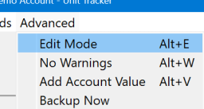
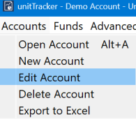
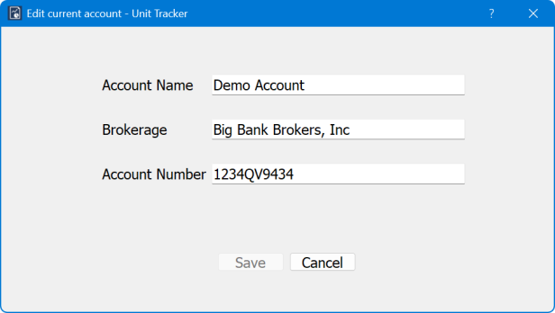
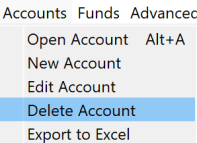
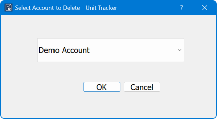
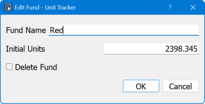
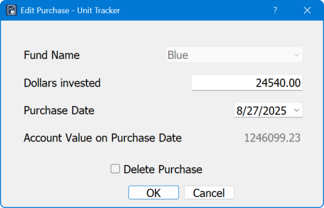
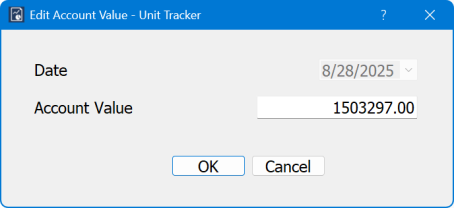

Editing your accounts should only be done with great care. When you go back in time to change a value or add a new purchase, it has an impact on every subsequent purchase. This is because you are changing the number of existing units from that point in time forward, changing the value of units at every purchase point after that. There are times when edits are unavoidable, but be aware of the ripple effects. If you have been providing donors with stewardship reports, the value of their accounts will have changed for reporting periods after the date on the edit (not the date when the edit occurred, but the date for which a purchase was changed or added.) In addition, there is no "undo" capability. You should backup your `accounts.db` file before starting edits and keep track of the name of the file so that you can restore the previous state if necessary. 

## Enabling Editing

By default the edit functions are not available. You may have noticed that menu items related to editing are grayed-out, preventing you from using them. Likewise, double-clicking on a cell has no effect. You can enable editing by cllcking `Advanced->Edit Mode` on the main menu or using the `Alt-E` shortcut key.

## Disabling Warnings

Because of the potential for damaging your records, all edits are accompanied with a warning that you must confirm before the edit is committed. If you're doing a lot of edits you can disable the warnings from `Advanced->No Warnings` menu item or using the `Alt-W` shortcut key. You are on your own if you disable the warnings. 

## Editing the Account Information

As noted in the section *Getting Started*, the account information is for your use only. It carries no significance within the UnitTracker program. Editing this information will have no impact on the count of units. You might want to edit if you've changed investment advisor or brokerage firm or perhaps because account numbers have changed. As in the case of all edits, there is no undo. You can always manually edit back to the original information, but you will have to know the values in order to do that. You can only edit the currently open account.

To edit account information, click `Accounts->Edit Account`

This will pop up the edit dialog:

Make the changes you desire and click `Save`. If you change your mind about editing the account, just click `Cancel`.

## Deleting an Account

There aren't very many good reasons for deleting an account, especially if you are a non-profit and the only account in the database is yours. You will lose all your information and history if you delete an account. Deleting an account is mostly useful if you were experimenting and created one or more accounts to experiment with and want to clean up your databae. If you are an investment advisor to multiple non-profits, you might want to delete an account that you no longer manage. Be reminded that once you delete an account you cannot recover the data unless you restore from a backup, which has it's own consequences. 

To delete an account, click `Accounts->Delete Account`

This dialog will pop-up:

You can select any account to delete *except the currently open account*. If you select the open account, the request will be refused. 

## Editing the tables

Each of the tables can be edited by double clicking any cell in the row you wish to edit. 

### Editing the Funds table

Double-clicking any cell with pop up this dialog with the fund shown in the row you clicked:

From this dialog you can change the name of a fund, change the number of initial units, or completely delete the fund. Changing the initial units or deleting the fund will cause every other fund to recalculate the number of units it owns. 

### Editing the Purchases table

Double-clicking any cell will bring up this dialog for the purchase shown in the row you clicked.

Because you can't change the fund associated with this purchase, if the problem is that you assigned the purchase to the wrong fund you will have to delete the purchase and create a new one using the New Purchase menu item. To delete the purchase, just check the `Delete Purchase` box and click OK. 

Recall that if you change the Dollars Invested, this will ripple through the account changing the units purchased in every transaction that follows this one. 

You can change the date, but again, this will cause a ripple through all the funds. If you change to date to a date for which the Account Value is known, the account value box will update to the known value and remain gray indicating that you can't update the value from this dialog. If you need to changed the account value for a date, you will have to do that from the Account Values table.

### Editing the Account Values table

The Account Values table shows the total value of your endowment account on various dates. The source of this value is external to UnitTracker &mdash; it probably comes from either a statememnt from your investment advisor, or from checking the value of your investment portfolio on your broker's website. 

Double-clcking an entry in the Account Values table will bring up this dialog:

. 

Fund purchases are tied to the account value on the date of the purchase. This means that changing the date of an account value entry or, deleting the entry, would leave the fund purchase with no way to compute the number of shares. Because of this, you cannot change the date in the edit dialog, nor can you delete the entry. If you have a fund purchase tied to the wrong date, [edit the fund purchase](#editing-the-purchases-table).