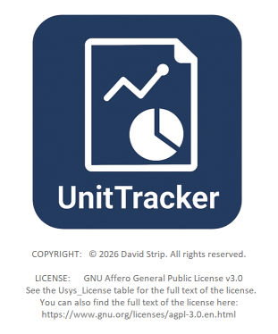
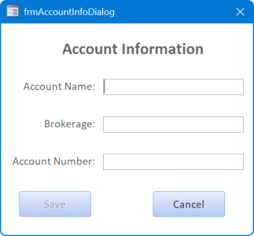
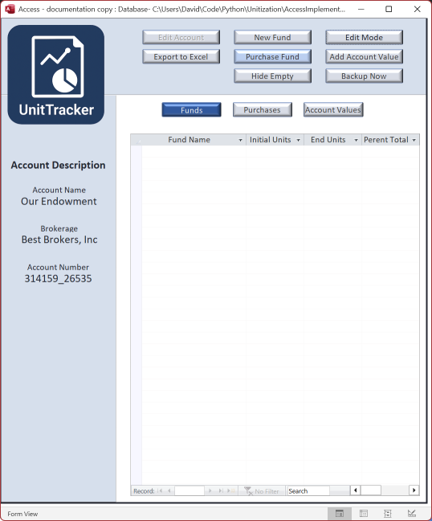
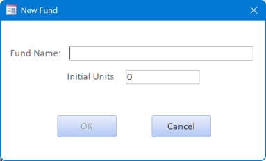
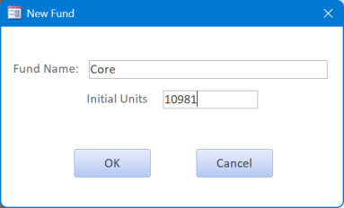
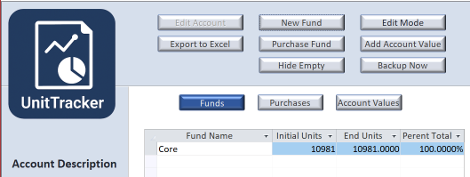
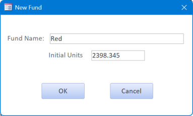
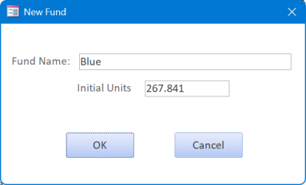
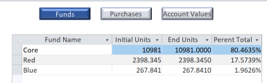

The first time you run UnitTracker, you will most likely receive a warning about macros and a note telling you they are blocked from working. You need to unblock the file. [This Microsoft page](https://support.microsoft.com/en-US/Office/vba/a-potentially-dangerous-macro-has-been-blocked) explains how to unblock the macros. 

To run UnitTracker, just double-click on the renamed .accdb file in the File Explorer Window. A splash screen with copyright and licensing information will appear and hang around for about 5 seconds. 

Once the splash screen has disappeared, the New Account dialog will appear:

\

Select `New Database`. We will cover the other uses later. 

The Account Information dialog will now appear:

Fill in the appropriate values for the account. The values in the fields are strictly for your convenience. They have no specific meaning internal to UnitTracker, so feel free to fill them in any way that is meaningful to you. You can always edit this information later.

Once you click `Save`, the main UnitTracker window will open:

## Starting with a non-unitized endowment
If your endowment is not already unitized, create a single fund that represents the total assets of your account. You can select the number of shares to be anything you want, but it is often convenient to select a number of shares so that the initial value is around $10 per share. To do so, just set the number of shares to be the value of the account divided by 10. You don’t need to keep all the decimal places, but there is no harm in doing so.
To create the initial fund, click on `New Fund` in the top row of buttons at the top of the window.

Fill in the appropriate values. Select a name for the fund that has meaning to you. “Core” is a convenient name, but feel free to choose something that has more meaning for you. 

After you click OK, the main window will now display your new fund: 

## Starting from an already unitized fund
If you are transferring your tracking from another solution, you will need to transfer the information from the old solution to UnitTracker. Start by getting your most recent data listing all the funds (in the UnitTracker sense) in the endowment and the current number of units in each fund. Be sure to include your core fund, or whatever it is called in your existing solution. 

For each fund you will follow the Add Fund instructions given above, but this time you will use the actual number of shares for each fund – you cannot chose an arbitrary unit. 

The main window now displays all your funds:
 

Your account is now fully initialized.

Note that this approach initializes UnitTracker with the current state of your endowment, it does not maintain the history. If you want to transfer the entire history, we will cover that in the [Importing](importing.md) section. 
