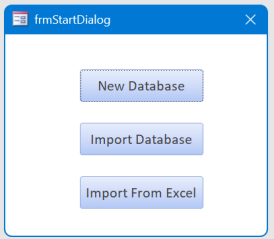
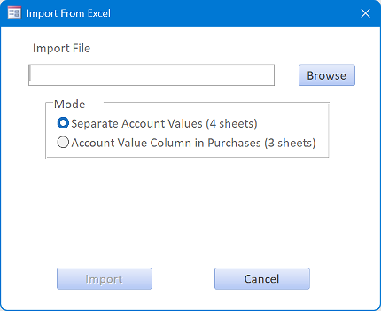
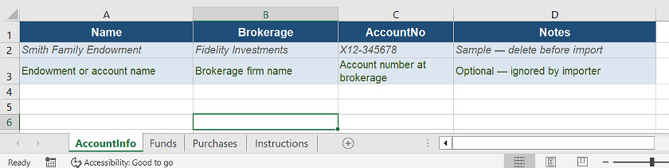
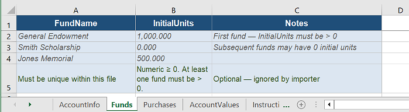
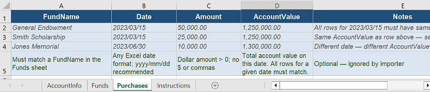
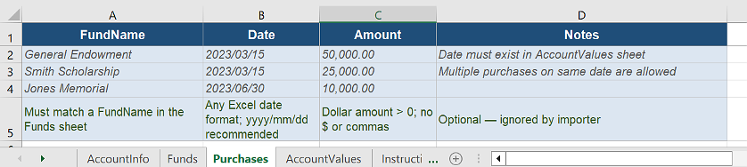
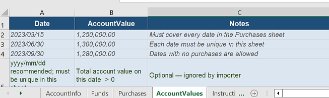

UnitTracker has the ability to import it's initial data from an Excel spreadsheet. Recall that when you first opened the .accdb file you were presented with this dialog:

By selecting `Import from Excel` you will be presented with this dialog:

Clicking the `Browse` button will open a standard file selection dialog from which you can pick the .xlsx file you wish to import.

There are two templates you can pick from to format the data you wish to import. One template contains three sheets - account info, funds, and fund purchases with the account value accompanying the purchase information. The other template has four sheets. The account info and funds sheets are the same as before, but the account values are split out on a fourth sheet. Both also include an additional sheet with instructions. The templates have sample data highlighted in gray that must be removed before you import.

The templates can be downloaded here:

[Three Sheets](https://www.unittracker.org/UnitTracker_Import_Template_Three_Sheets.xlsx)   
[Four Sheets](https://www.unittracker.org/UnitTracker_Import_Template_Four_Sheets.xlsx)

Here's what the AccountInfo sheet looks like in both templates:

You will need to delete the entries in the  gray cells and insert your account info.

Here's the sample funds sheet:

In the three-sheet template purchases are entered with the account value on the date of the purchase:

Take care that all purchases occurring on the same date have the same AccountValue. The import will fail if the values for a given day don't match. 

In the four sheets template purchases reference the account value by date:

The account values are stored in a separate sheet:

Which template should you use? That depends on how your data is currently stored. Pick the one that is easiest to generate from your existing data.

