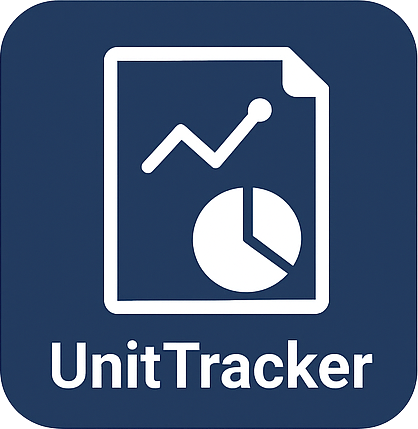

# Welcome to UnitTracker

 
 

UnitTracker is a Windows program designed to manage small endowments, typically under $250M. There is nothing about the design that prevents use with larger endowments, but there are more sophisticated programs designed for large endowments that provide additional features. UnitTracker can be used to manage multiple endowments, as might be the case for an investment firm managing the endowments of multiple non-profits or educational institutions. It will work equally well for in-house unit management in an organization with a single endowment to manage.