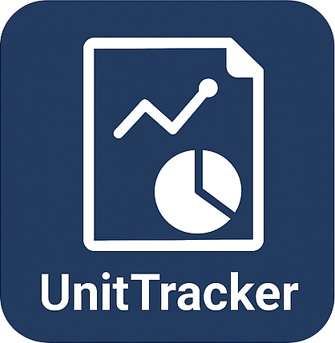

# Welcome to UnitTracker

 
 

UnitTracker is an MS Access database designed to manage small endowments, typically under $250M. There is nothing about the design that prevents use with larger endowments, but there are more sophisticated programs designed for large endowments that provide additional features. Each copy of the database is used to manage a single endowment, but you can keep multiple copies of the database on your computer if you are resposible for unit tracking of multiple endowments. 

Documentation for UnitTracker can be found [here](https://www.unittracker.org).

UnitTracker is free and open source. It is licensed  under the GNU Affero General Public License v3.0 - see the [LICENSE](agpl-3.0.txt) file for details.
All the code is stored within the database and can be freely accessed.
Because this is a standard Access database, you can extend the capbilities to produce additional reports to meet the needs of your organization.
