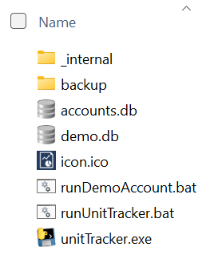

Installation:
UnitTracker is provided as a .zip file. You can install it anywhere you want on your system with the exception of the Program Files or Program Files (x86) directories which will cause permissions problems.

Create a directory called UnitTracker anyplace on your system. Common choices would be `C:\UnitTracker` or `C:\users\\\<user name>\AppData\Roaming\UnitTracker`. These are just suggestions – feel free to install wherever you want, just remember where you put it. 

Double-click on the `UnitTracker. zip` file and when it asks where to unzip, give the directory you just created. 

If you now look at the UnitTracker directory, you should see these files:

 
All the account information is stored in the file called `accounts.db`. You must be sure that you are backing up this file; if you lose it or overwrite it, you will lose all record of your tracking. You cannot install UnitTracker in two different places and expect things to work well as you will end up with two independent databases that know nothing about one another. This is OK if you’re tracking different accounts, but in general is a bad practice. 

Every time you run UnitTracker the `accounts.db` file will be copied to the backup directory. If you make a mistake, lose or corrupt your file, you can step back in time by copying a file from the backup directory to the UnitTracker directory and renaming it `accounts.db`. The backup directory also contains backups from each time you run the demo file, so you can restore that to a past state as well by copying to the UnitTracker directory and renaming to demo.db.

The unpacked .zip file contains two .bat files that simplify running UnitTracker. You might want create shortcuts to drag to your desktop to make it easy to run UnitTracker. Double-clicking the .bat file `runDemoAccount.bat` will run UnitTracker using an alternative accounts file called demo.db. You can experiment with this to your heart’s content knowing that you are not corrupting your real accounts. Use this while learning, experimenting, or teaching someone. Double-clicking `runUnitTracker.bat` will load your real accounts database. 

If you are moving UnitTracker to a new computer you will need to copy the `accounts.db` file from the old computer to the new. The .zip contains an empty `accounts.db` file that you need to overwrite. 
 
