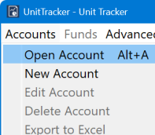
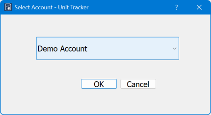
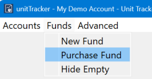
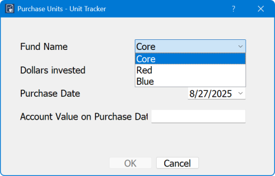
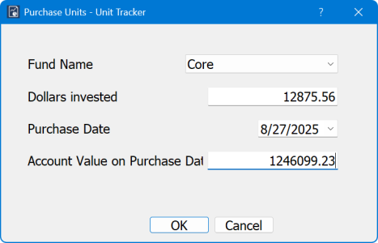
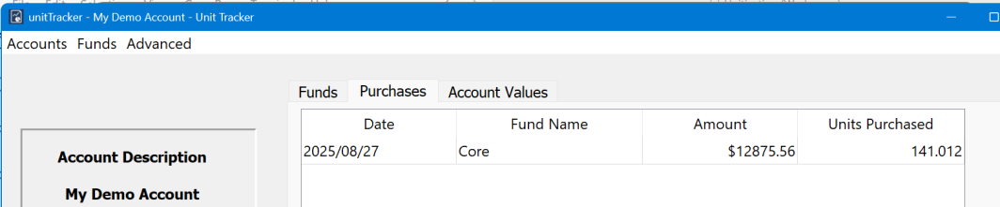
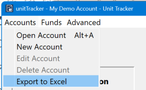

## Selecting an account to work on

When you launch UnitTracker, you will need to open the account you want to work on. For users managing multiple accounts, you may need to switch to a different account to manage. In both cases just `Click Accounts->Open Account`

and select the account you want to work on:

## Adding to a fund

Over time you will be receiving new donations to deposit into your account. These might be unrestricted, which will go into the core account, or they may be restricted donations that go into an existing fund or create a new fund. Let’s begin with a donation into an existing fund.
From the main menu, select `Funds->Purchase Fund:`

Select the fund you are purchasing

and fill in the amount and date:

 
Note that you can only pick from an existing fund. If you are purchasing for a new fund, you must create the fund first. If an account value already exists for the purchase date, it will be filled in for you. You cannot change that value here. If it’s wrong, you will have to use the edit function (see section Advanced Functions). 

## Viewing the Tables

Clicking on the Purchases tab will show all the purchases for this account:

## Exporting Excel

UnitTracker provides the means to export all the data to an Excel spreadsheet to allow you to share with others or to create a human readable backup. Select `Accounts->Export To Excel`

Clicking this will open the usual File Save dialog. You can save the .xlsx file any place you want, just remember where you put it. You will receive the usual warnings if you try to overwrite a file or use the name of a file that is already open in Excel.

## Sorting the tables

The table on the Purchases tab can be sorted by clicking on the column header. This is useful when you have a long list of purchases and want to organize the purchases by fund, date, number of units, or dollar value of the purchase. Here we see the table sorted by fund name. 
