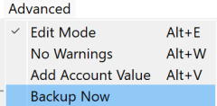
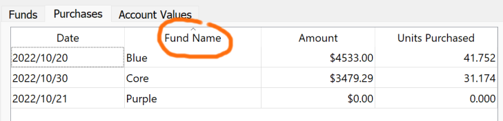

## Protecting your data

Every time you launch UnitTracker the `accounts.db` file is backed up to the `backup` folder. The file name has the format `accounts_yyyy_mm_dd_hh_mm.db`. At the time this was written the last launch of UnitTracker was on Sept 11, 2025 at 16:27 (4:37PM in 24 hour format). This created a backup with filename `accounts_2025_09_11_16_27.db`. (If you launch the demo account the backup will have a format of `demo_yyyy_mm_dd_hh_mm.db`.)

Because there is no undo function, if you're adding a lot of entries in a session or doing a lot of edits, it is prudent to periodically backup your database so that you can restore to an ear &mdashr point if you discover you've made an error. (You can also correct errors using edits &mdash; see [Editing](editing.md).)

### Creating backups

You can create a backup at any time by clicking the menu `Advanced-> Backup Now`

Over time the `backup` directory will accumulate a large number of files. Most of these files are worthless because restoring them would cause you to lose all the entries you've made since the backup was created. Feel free to delete old backup files to reduce clutter.

There is nothing significant about the name of the backup file other than as a means to help you locate a file from a particular time and date. You can rename files that correspond to major events if that helps with your file organization. For example, you might label a backup `Fall 2025 Audit.db` to archive the database on the date of your audit. 

### Restoring from a backup

Before restoring from a backup be sure that there are no entries in your current accounts that you can't reproduce if you have to. [Exporting as an Excel workbook](#exporting-to-excel) is a convenient way to have a readable copy of the state of the database before the restore. You might also want to manually create a backup and rename that backup to something you will recognize like `before_restore_2025_09_12.db`.

To restore a backup:
1. Copy the file from backup directory to UnitTracker install directory you created in the [Installation](installation.md) step. If you use drag/drop you will be *moving* the file not copying it, which means that you will lose the backup if you need it in the future. If you hold down the Ctrl key while dragging you will copy the file. 
2. Delete the `accounts.db` file in the UnitTracker install directory and 
3. Rename the copied backup file to `accounts.db`. 

You've now restored your accounts to the state they had at the moment the backup was created. 

## Selecting an account to work on

When you launch UnitTracker, you will need to open the account you want to work on. For users managing multiple accounts, you may need to switch to a different account to manage. In both cases just `Click Accounts->Open Account`

and select the account you want to work on:

## Adding to a fund

Over time you will be receiving new donations to deposit into your account. These might be unrestricted, which will go into the core account, or they may be restricted donations that go into an existing fund or create a new fund. Let’s begin with a donation into an existing fund.
From the main menu, select `Funds->Purchase Fund:`

Select the fund you are purchasing

and fill in the amount and date:

 
Note that you can only pick from an existing fund. If you are purchasing for a new fund, you must create the fund first. If an account value already exists for the purchase date, it will be filled in for you. You cannot change that value here. If it’s wrong, you will have to use the edit function (see section Advanced Functions). 

## Viewing the Tables

There are three tables that show the status of your account. The Funds table lists all funds with the number of initial units, end (current) units, and the percentage of the overall account. 

The Purchases Table shows each purchase of units by each fund. The table shows the date of the purchase, the fund name, the dollar amount of the purchase, and the number of units purchased.

The Account Values table shows the value of your account for various dates. There is an entry for each date one or more funds purchased units. In addition, you can create a new entry using the   `Advanced->Add Account Value` menu choice to manually create an entry for any date. 

Clicking on the tab associated with a table will bring up that table. For example, clicking the Purchases tab will show all the purchases for the current account:

## Exporting to Excel

UnitTracker provides the means to export all the data to an Excel spreadsheet to allow you to share with others or to create a human readable backup. Select `Accounts->Export To Excel`

Clicking this will open the usual File Save dialog. You can save the .xlsx file any place you want, just remember where you put it. You will receive the usual warnings if you try to overwrite a file or use the name of a file that is already open in Excel.

## Sorting the tables

The tables on the Funds and Purchases tabs can be sorted by clicking on a column header. This is useful when you have a long list of purchases and want to organize the purchases by fund, date, number of units, or dollar value of the purchase. Here we see the purchases table sorted by fund name instead of the default sort by purchase date. Note the little arrow above Fund Name indicating the sort is A → Z (vs. Z → A). Clicking again will reverse the sort order.

