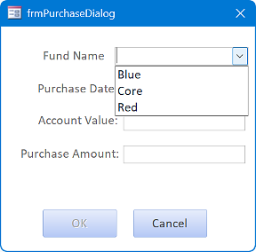
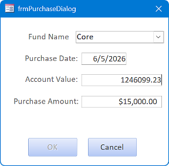
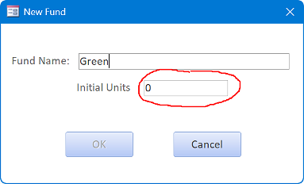
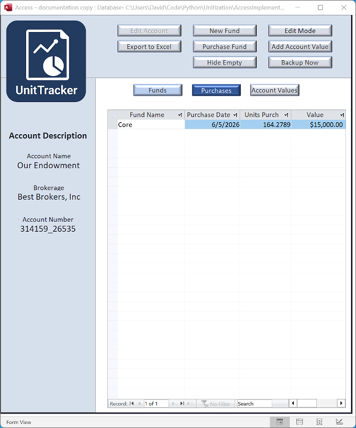
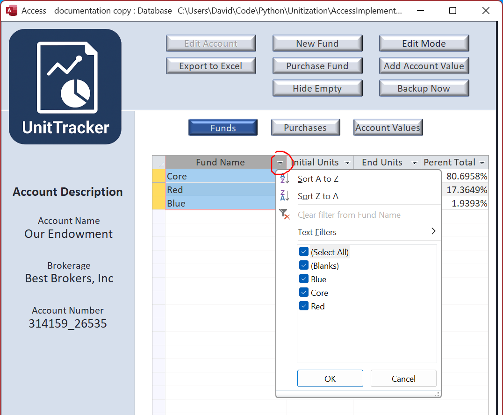

## Protecting your data

The first time you ran UnitTracker a `backup` folder was created in the folder where you stored the .accdb file. Every time you launch UnitTracker a copy of the current .accdb file is backed up to the `backup` folder. The file name has the format `<file_name>_yyyy_mm_dd_hh_mm.accdb`. A backup created on Sept 11, 2025 at 16:27 (4:37PM in 24 hour format) has filename `my_account_2025_09_11_16_27.db`. 

Because there is no undo function, if you're adding a lot of entries in a session or doing a lot of edits, it is prudent to periodically backup your database so that you can restore to an earlier point if you discover you've made an error. (You can also correct most errors using edits &mdash; see [Editing](editing.md).)

### Creating backups

You can create a backup at any time by clicking the `menu `Advanced-> `Backup Now` hutton in the third row of buttons at the top of the UnitTracker window.

Over time the `backup` folder will accumulate a large number of files. For this reason UnitTracker will pop up an reminder to remove excess files.  Backup files quickly beccome worthless because restoring them would cause you to lose all the entries you've made since the backup was created. You can delete old backup files to reduce clutter once you are confident that you don't need to restore an earlier state. 

There is nothing significant about the name of the backup file other than as a means to help you locate a file from a particular time and date. You can rename files that correspond to major events if that helps with your file organization. For example, you might label a backup `Fall 2025 Audit.db` to archive the database on the date of your audit. In addition, you can move important backups (like the one corresponding to an audit) to another location on your computer. You can open a backup file by double clicking. Just remember - any changes you make will not be reflected in your main file.

### Restoring from a backup

Before restoring from a backup be sure that there are no entries in your current accounts that you can't reproduce if you have to. [Exporting as an Excel workbook](#exporting-to-excel) is a convenient way to have a readable copy of the state of the database before the restore. You might also want to manually create a backup and rename that backup to something you will recognize like `before_restore_2025_09_12.db`.

To restore a backup:
1. Copy the file from the backup folder to the [Installation](installation.md) step. If you use drag/drop you will be *moving* the file not copying it, which means that you will lose the backup if you need it in the future. If you hold down the Ctrl key while dragging you will copy the file. 
2. Delete the .accdb file in the UnitTracker  folder and 
3. Rename the copied backup file to the name you used for your UnitTracker database. 

You've now restored your accounts to the state they had at the moment the backup was created. 

## Adding to a fund

Over time you will be receiving new donations to deposit into your account. These might be unrestricted, which will go into the core account, or they may be restricted donations that go into an existing fund or create a new fund. Let’s begin with a donation into an existing fund.
From second row of buttons,click `Purchase Fund`

Select the fund you are purchasing

and fill in the amount and date:

 
Note that you can only pick from an existing fund. If you are purchasing for a new fund, you must create the fund first using the `New Fund` button you used when you initally created the account. If an account value already exists for the purchase date, it will be filled in for you. You cannot change that value here. If it’s wrong, you will have to use the edit function (see section Advanced Functions). 

##  Creating a new fund

When we first set up the acccount we used the `New Fund` button to create funds for our account. We can use this at any time to create additional funds, such as when we receive a new restricted gift. Once the overall account has been initialized, you should not have a value in the initial units box except in very rare cases when you are trying to correct an error in the initial creation of the account. If you include a non-zero value in the Initial Units field, the number of units in every fund will be recalculated, potentially changing the unit balance of every fund. 

## Viewing the Tables

There are three tables that show the status of your account. The Funds table lists all funds with the number of initial units, end (current) units, and the percentage of the overall account. 

The Purchases Table shows each purchase of units by each fund. The table shows the date of the purchase, the fund name, the dollar amount of the purchase, and the number of units purchased.

The Account Values table shows the value of your account for various dates. There is an entry for each date one or more funds purchased units. In addition, you can create a new entry using the   `Add Account Value`  button to manually create an entry for any date. 

Clicking on the button associated with a table will bring up that table. For example, clicking the Purchases button will show all the purchases for the current account:

## Exporting to Excel

UnitTracker provides the means to export all the data to an Excel spreadsheet to allow you to share with others or to create a human readable backup. Just tap the `Export To Excel` button in the second row.

Clicking this will open the usual File Save dialog. You can save the .xlsx file any place you want, just remember where you put it. You will receive the usual warnings if you try to overwrite a file or use the name of a file that is already open in Excel.

## Sorting the tables

The tables on the Funds and Purchases tabs can be sorted by clicking   the arrow on the right edge a column header. This is useful when you have a long list of purchases and want to organize the purchases by fund, date, number of units, or dollar value of the purchase. Here we see the funds table sorted by fund name instead of the default sort by creation date. 

